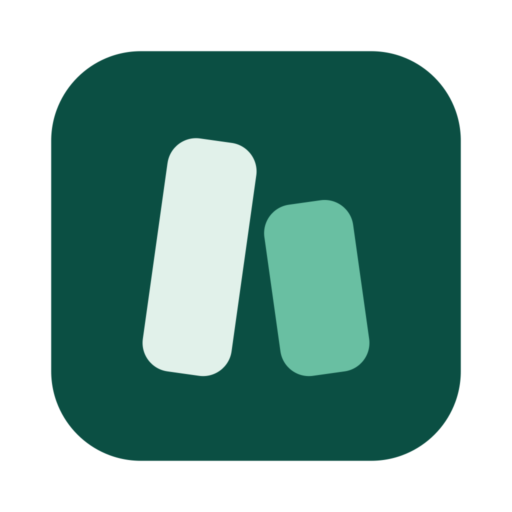
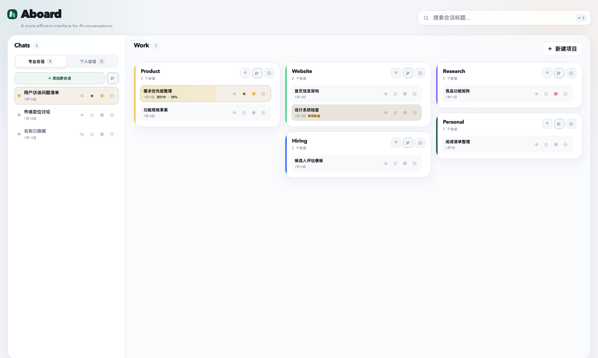
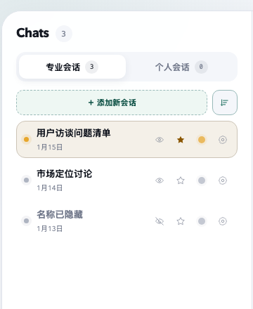

# Aboard

  

<strong>把散落在 ChatGPT 和 Codex 里的对话，整理成一张看板。</strong>

  <a href="https://github.com/NicoStudio/aboard/releases/latest/download/Aboard-macOS-1.0.4.zip"><strong>下载最新版</strong></a>
  ·
  <a href="https://github.com/NicoStudio/aboard/releases/latest">查看更新</a>

Aboard 是一款 macOS 应用：左边整理 Chat，右边按项目整理 Work。它不复制对话内容，只帮你更快找到、归类和打开原来的会话。

## 看图就会用

### Chat 拖到需要的标签

把左侧的 Chat 直接拖到“专业会话”或“个人会话”。每条会话右侧还可以：

- 点击眼睛，隐藏或重新显示名称。
- 点击星标，把重要会话置顶。
- 点击彩色圆点，设置优先级。

### Work 和项目卡片都能移动

- 把 Work 拖进任意项目，也可以在项目之间移动。
- 拖动整张项目卡片，调整它所在的栏位和先后顺序；卡片会自动紧凑排列。
- 正在运行的 Work 会显示状态、百分比和背景进度，不用打开会话也能看到进展。
- 等待你确认或输入时，Aboard 会直接在条目上提醒。

> 截图中的项目和会话全部是虚构演示数据，不会随安装包进入你的看板。

## 主要功能

- 把 Chat 分成“专业会话”和“个人会话”。
- 把 Codex Work 按项目整理成卡片。
- 直接拖拽会话，调整顺序或移动到其他项目。
- 显示正在运行、等待确认和上下文使用进度。
- 点击任意条目，直接在当前 Aboard 窗口继续原会话；进行中的会话也能返回后再次打开。
- Aboard 使用原来的会话，不复制正文；在 Aboard 和官方客户端看到的是同一条会话记录。
- 隐藏敏感标题、设置优先级、置顶重要会话。
- 自动跟随 ChatGPT/Codex 的浅色或深色主题。

## 三步安装

安装前请确认：

- Mac 已安装并登录官方 [ChatGPT/Codex 应用](https://openai.com/chatgpt/desktop/)。
- Mac 已安装 [Python 3](https://www.python.org/downloads/macos/)。

然后：

1. [下载 Aboard 安装包](https://github.com/NicoStudio/aboard/releases/latest/download/Aboard-macOS-1.0.4.zip)。
2. 双击下载的 ZIP，打开解压得到的 **Aboard** 文件夹。
3. 双击 **Install Aboard.command**，看到“安装完成”即可。

安装器会自动打开 Aboard。以后可以从“应用程序”或程序坞启动它。

> 如果 macOS 阻止打开安装器：按住 Control 点击 **Install Aboard.command**，选择“打开”，再确认一次。这通常只在第一次安装时出现。

## 第一次使用

1. 打开 Aboard。
2. 从左侧会话列表把 Chat 或 Work 拖进看板。
3. 点击会话即可在 Aboard 当前窗口继续；需要回到看板时，点击 Plugins 下的 Aboard。
4. 需要新对话时，直接点击目标区域里的“新建”；完成后 Aboard 会把它放回正确位置。

## 更新

下载最新版，再双击一次 **Install Aboard.command**。原来的看板和归类不会被覆盖。

版本规则：小修复使用 `1.0.1`，兼容的新功能使用 `1.1.0`，不兼容的大改动才使用 `2.0.0`。

## 卸载

双击 **Uninstall Aboard.command**。默认只移除应用，保留看板数据，方便以后重新安装。

## 常见问题

**为什么安装时会打开终端窗口？**

Aboard 会在你的 Mac 上完成本地安装和安全检查。等待出现“安装完成”即可，不需要输入命令。

**提示没有 Python 3 怎么办？**

从 [Python 官网](https://www.python.org/downloads/macos/) 安装最新版，然后重新双击安装器。

**安装后 Codex 里还是旧版本？**

完整退出并重新打开一次 ChatGPT/Codex。

**为什么某个 Work 提示正在另一个 Codex 窗口中运行？**

本地 Work 同一时间只能由一个客户端进程写入。Aboard 不会强行抢占，以免回复中断或重复执行；请先完整退出占用它的 ChatGPT/Codex 客户端，再回到 Aboard 打开。Aboard 自己新建或已经在 Aboard 中运行的会话，不受这个提示影响。

**Aboard 会上传我的对话吗？**

不会。发布包只有空白看板和合成演示数据；原会话仍保存在官方 ChatGPT/Codex 中。

**这是 OpenAI 官方产品吗？**

不是。Aboard 是独立社区项目，需要使用你已经安装的官方 ChatGPT/Codex macOS 应用。

## 更多信息

- [技术说明与开发指南](docs/TECHNICAL.md)
- [隐私说明](PRIVACY.md)
- [安全架构](SECURITY.md)
- [参与开发](CONTRIBUTING.md)

## License

[MIT](LICENSE) © Aboard contributors
